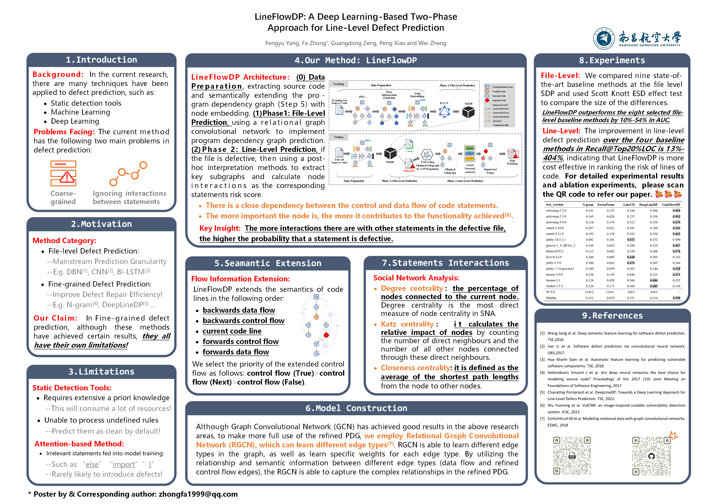

# This is a repository for "LineFlowDP: A Deep Learning-Based Two-Phase Approach for Line-Level Defect Prediction"


Preparation of "README.md" file referenced from DeepLineDP at this [github](https://github.com/awsm-research/DeepLineDP), Thanks! 🥰🥰🥰

---

## 🚀 Environment Configuration

1. **Clone the github repository:**

    ```bash
    git clone https://github.com/zzz-buct/LineFlowDP.git
    ```

2. **Download the dataset** from this [github](https://github.com/awsm-research/line-level-defect-prediction) and keep it in `datasets/original/`

3. **Install required libraries in conda environment:**

    ```bash
    conda env create -f environment.yaml
    conda activate LineFlowDP
    ```

4. **Install PyTorch** by following the instruction from this [link](https://pytorch.org/) (the installation instruction may vary based on OS and CUDA version)
  
---

## 📂 Datasets

The datasets are obtained from Wattanakriengkrai et. al. The datasets contain 32 software releases across 9 software projects. The datasets that we used in our experiment can be found in this [github](https://github.com/awsm-research/line-level-defect-prediction).

### **File-level datasets** (in the File-level directory) contain:

- `File`: A file name of source code  
- `Bug`: A label indicating whether source code is clean or defective  
- `SRC`: A content in source code file  

### **Line-level datasets** (in the Line-level directory) contain:

- `File`: A file name of source code  
- `Line_number`: A line number where source code is modified  
- `SRC`: An actual source code that is modified  

For each software project, we use the oldest release to train LineFlowDP models. The subsequent release is used as validation sets. The other releases are used as test sets.

> For example, there are 5 releases in ActiveMQ (e.g., R1, R2, R3, R4, R5), R1 is used as training set, R2 is used as validation set, and R3 - R5 are used as test sets.

---

## ⚙️ Data Preparation

### 1. Data Preprocess

Put the downloaded dataset into `datasets/original/` folder, then run **"preprocess_data.py"** to get the preprocessed data, the preprocessed data will be stored in `datasets/preprocessed_data/` folder.

```bash
python 1.preprocess_data.py
```

---

### 2. Getting Java Source Files

Run the following command to get the Java source code in csv files, the Java source code will be saved in the `sourcecode/` folder.
		
```bash
python 2.extract_Java_source_code_and_pdg_dot.py
```

---

### 3. Extracting Program Dependency Graphs

We use the PropertyGraph tool to extract program dependency graphs (PDG) in this repository [github](https://github.com/Zanbrachrissik/PropertyGraph), Thanks to them for providing such a handy tool!

PDG files are formatted as *.dot*. Then put the PDG file in the `sourcecode/[PROJECT]/[VERSION]/PDG/` folder, such as `sourcecode/activemq/activemq-5.0.0/PDG/`.

In the PDG file, it will contain data flow and control flow information, in order to refine the nodes and edges, run the following command to extract the information in the dot file, in which the information of the edges will be saved in `sourcecode/[PROJECT]/[VERSION]/[FILE_NAME]_pdg.txt`, to distinguish the data flow edges and refined control flow edges will be saved in `sourcecode/[PROJECT]/[VERSION]/[FILE_NAME]_edge_label.txt`, and refined node types will be saved in a csv file in the `used_file_data` folder.

```bash
python 3.dot_to_txt.py
```

---

### 4. Flow Information Extension & Word Embedding

- **Flow Information Extension**: Run the command in the `do2vec` folder to get the lines of code after the flow information extension, and merge these statements into a corpus for the whole project for subsequent training of the do2vec model.
 
    ```bash
    python ./doc2vec/4.flow_information_extension.py
    ```
 
- **Word Embedding**: Run **train_doc2vec_model.py** in the `do2vec` folder to train the corresponding doc2vec model of the project and save it locally, and then run word **embedding.py** in the `do2vec` folder to get the word vectors of the utterances that have been expanded with the flow information and save it as a *.txt* file.
 
    ```bash
    python ./doc2vec/5.train_doc2vec_model.py
    python ./doc2vec/6.word_embedding.py
    ```

---

### 5. Get the TUDataset raw file format

In order to realize the training process afterwards, the data obtained after the above steps are needed to processing into a file in TUDataset raw format.

Run the command to get the TUDataset raw files for software projects:

```bash
python 7.TUDataset_raw.py
```

TUDataset raw file will contain the following six files: DS_A, DS_edge_labels, DS_graph_indicator, DS_graph_labels, DS_node_attributes, DS_node_labels.

- `DS_A`: The edges in the graphs. (The adjacency matrix of the graph.)
- `DS_edge_labels`: Indicating that the edge corresponds to the data flow edge or the refined control flow edge.
- `DS_graph_indicator`: Indicating which graph/file this edge corresponds to.
- `DS_graph_labels`: Indicating whether the graph/file has defects, 0 for no defects, 1 for defects.
- `DS_node_attributes`: Word vectors extracted from Doc2Vec model after Flow Information Extension.
- `DS_node_labels`: Indicating the type of node after refinement.
- `DS_node_ids.txt`: Indicating the line number of node in each graph/file.
 
And the TUDataset raw file will be stored in `sript/data/[PROJECT]/[VERSION]/raw/`.
 
Then run **8.TUDataset_processed.py** to get the processed TUDataset data, it will contain `"data.pt"`, `"pre_filter.pt"` and `"pre_transform.pt"` three files.

```bash
python 8.TUDataset_processed.py
```

---

## 🏋️ Training the RGCN Model

To leverage the information in our refined program dependency graph, we constructed a Relational Graph Convolutional Network model.

Run the following command to train the model, the trained model will be saved in `script/checkpoints/` folder. 

For different software projects, you may need to adjust the model parameters appropriately to achieve optimal performance.

```bash
bash 9.run_train.sh
```

---

## 🧪 Testing the RGCN Model and Getting the Results

Run the following command to test the model, and getting the key sub-graph via GNNExplainer.  
Meanwhile, you will also obtain the values of Katz centrality, closeness centrality, 
and degree centrality in the key sub-graph for social network analysis.

```bash
bash 10.run_test.sh
```

## ✨ The Poster of LineFlowDP

<p align="center">
  
</p>

## 😍 Citation
If you find this repository useful, please consider citing our paper:

```bibtex
@article{Yang2024LineFlowDP,
  author = {Yang, Fengyu and Zhong, Fa and Zeng, Guangdong and Xiao, Peng and Zheng, Wei},
  title = {LineFlowDP: A Deep Learning-Based Two-Phase Approach for Line-Level Defect Prediction},
  journal = {Empirical Software Engineering},
  volume = {29},
  number = {2},
  year = {2024},
  doi = {10.1007/s10664-023-10439-z},
  url = {https://doi.org/10.1007/s10664-023-10439-z}
}
```